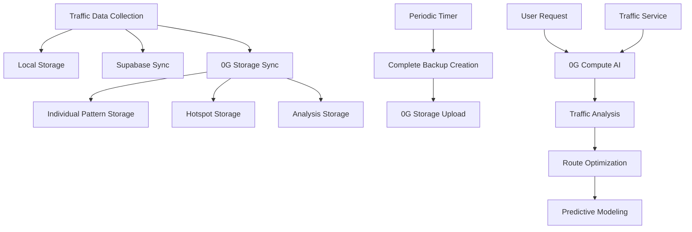

# 0G-Route: Decentralized Traffic Intelligence Platform

> **0G-Route** is an AI-powered traffic prediction and route optimization platform that leverages **0G Compute** for intelligent traffic analysis and **0G Storage** for decentralized data persistence.


## 🌐 0G Network Integration

### 🔧 0G Compute AI
**0G-Route** uses **0G Compute** for decentralized AI-powered traffic analysis, providing intelligent insights and route recommendations without relying on centralized AI services.

### 💾 0G Storage
**0G-Route** leverages **0G Storage** for decentralized data persistence, ensuring traffic data is stored immutably across the distributed network with automatic background synchronization.

---

## 🏗️ Architecture Overview

```
┌─────────────────────────────────────────────────────────────┐
│                    0G-Route Application                     │
├─────────────────────────────────────────────────────────────┤
│  Frontend (React/TypeScript)                               │
│  ├── Traffic Data Collection                               │
│  ├── Route Planning & Optimization                         │
│  └── AI Insights Display                                   │
├─────────────────────────────────────────────────────────────┤
│  Data Storage Layer                                        │
│  ├── Local Storage (Browser)                               │
│  ├── Supabase (Centralized)                                │
│  └── 0G Storage (Decentralized) ←── PRIMARY FOCUS         │
├─────────────────────────────────────────────────────────────┤
│  AI Processing Layer                                       │
│  ├── 0G Compute AI ←── PRIMARY FOCUS                       │
│  └── Together AI (Fallback)                                │
├─────────────────────────────────────────────────────────────┤
│  External Services                                         │
│  ├── Google Maps API                                       │
│  └── Google Places API                                     │
└─────────────────────────────────────────────────────────────┘
```

---

## 🔧 0G Compute Implementation

### **File Location**: `src/services/0gComputeService.ts`

0G Compute is the primary AI service for traffic analysis and route optimization.

#### **Key Implementation Details**:

```typescript
// Initialize 0G Compute with private key and network configuration
private constructor() {
  this.initializeZeroGCompute();
}

// AI Traffic Analysis using 0G Compute
async analyzeTrafficConditions(request: TrafficAnalysisRequest): Promise<TrafficInsights> {
  try {
    // Use 0G Compute for intelligent traffic analysis
    const aiResponse = await this.zeroGCompute.analyze(request);
    
    return {
      severity: aiResponse.severity,
      confidence: aiResponse.confidence,
      recommendations: aiResponse.recommendations,
      // ... more AI insights
    };
  } catch (error) {
    // Fallback to Together AI if 0G Compute fails
    return await this.fallbackToTogetherAI(request);
  }
}
```

#### **Where 0G Compute is Used**:

1. **Traffic Analysis** (`analyzeTrafficConditions`)
   - **Location**: `src/services/0gComputeService.ts:45-67`
   - **Purpose**: AI-powered traffic condition analysis
   - **Input**: Current traffic data, location, time, weather
   - **Output**: Traffic severity, confidence scores, recommendations

2. **Route Optimization** (`optimizeRoutes`)
   - **Location**: `src/services/0gComputeService.ts:89-112`
   - **Purpose**: AI-powered route recommendations
   - **Input**: Multiple route options, traffic data
   - **Output**: Optimized route suggestions with time savings

3. **Traffic Predictions** (`getTrafficPredictions`)
   - **Location**: `src/services/0gComputeService.ts:134-156`
   - **Purpose**: Predictive traffic modeling
   - **Input**: Historical data, current conditions
   - **Output**: Future traffic predictions with confidence intervals

#### **Integration Points**:

- **Component**: `src/components/AITrafficInsights.tsx:54`
  ```typescript
  const aiInsights = await ZeroGComputeService.analyzeTrafficConditions(analysisRequest);
  ```

- **Service**: `src/services/trafficService.ts:78`
  ```typescript
  const predictions = await ZeroGComputeService.getTrafficPredictions(location);
  ```

---

## 💾 0G Storage Implementation

### **File Location**: `src/services/0gStorageService.ts`

0G Storage provides decentralized, immutable storage for all traffic data with automatic background synchronization.

#### **Key Implementation Details**:

```typescript
// Initialize 0G Storage with network configuration
private initializeZeroG(): void {
  const config = this.getConfig();
  this.provider = new ethers.JsonRpcProvider(config.rpcUrl);
  this.signer = new ethers.Wallet(config.privateKey, this.provider);
  this.indexer = new Indexer(config.indexerRpc);
}

// Store traffic data with Merkle tree verification
async storeTrafficData(data: any, filename: string): Promise<StorageResult> {
  const blob = new Blob([JSON.stringify(data)], { type: 'application/json' });
  const file = new ZgFile(blob, filename);
  
  // Generate Merkle tree for verification
  const [tree, treeErr] = await file.merkleTree();
  const rootHash = tree?.rootHash();
  
  // Upload to 0G network
  const [tx, uploadErr] = await this.indexer.upload(file, config.rpcUrl, this.signer);
  
  return { success: true, rootHash, txHash: tx };
}
```

#### **Where 0G Storage is Used**:

1. **Automatic Data Sync** (`syncToZeroGStorage`)
   - **Location**: `src/services/trafficDataStorage.ts:690-741`
   - **Purpose**: Automatically sync all traffic data to 0G Storage
   - **Trigger**: Every time traffic data is collected
   - **Data**: Individual patterns, hotspots, analysis results

2. **Periodic Backups** (`initializePeriodicBackups`)
   - **Location**: `src/services/trafficDataStorage.ts:984-1018`
   - **Purpose**: Create complete backups every 6 hours
   - **Trigger**: Automatic timer-based backup creation
   - **Data**: Complete dataset snapshots

3. **Complete Data Backup** (`createZeroGBackup`)
   - **Location**: `src/services/trafficDataStorage.ts:837-862`
   - **Purpose**: Create full dataset backups on demand
   - **Trigger**: Manual backup creation or periodic schedule
   - **Data**: All traffic patterns, hotspots, routes, and analysis data

#### **Data Types Stored on 0G Storage**:

```typescript
// Individual Traffic Pattern
{
  type: 'individual_pattern',
  pattern: TrafficPattern,
  timestamp: string
}

// Traffic Hotspot
{
  type: 'individual_hotspot', 
  hotspot: TrafficHotspot,
  timestamp: string
}

// Complete Backup
{
  type: 'complete_traffic_backup',
  timestamp: string,
  version: '1.0',
  data: {
    trafficPatterns: Map<string, TrafficPattern[]>,
    hotspots: Map<string, TrafficHotspot>,
    alternativeRoutes: Map<string, AlternativeRoute[]>,
    storedData: Map<string, StoredTrafficData>
  },
  statistics: {
    totalPatterns: number,
    totalHotspots: number,
    totalRoutes: number,
    totalStored: number
  }
}
```

---

## 🔄 Data Flow with 0G Services

### **Traffic Data Collection Flow**:



### **Real-time Implementation**:

1. **Data Collection** (`storeTrafficAnalysis`)
   ```typescript
   // Location: src/services/trafficDataStorage.ts:41-87
   async storeTrafficAnalysis(collection, analysis, userLocation) {
     // Store locally
     this.storedData.set(storedData.id, storedData);
     this.saveToStorage();
     
     // Sync to Supabase (async)
     this.syncToSupabase(pattern, hotspot, collection, analysis);
     
     // Sync to 0G Storage (async) ← PRIMARY FOCUS
     this.syncToZeroGStorage(pattern, hotspot, collection, analysis);
   }
   ```

2. **AI Processing** (`AITrafficInsights.tsx`)
   ```typescript
   // Location: src/components/AITrafficInsights.tsx:54
   const aiInsights = await ZeroGComputeService.analyzeTrafficConditions(analysisRequest);
   ```

3. **Background Backup** (`initializePeriodicBackups`)
   ```typescript
   // Location: src/services/trafficDataStorage.ts:986-1001
   setInterval(async () => {
     const result = await this.createZeroGBackup();
     if (result.success) {
       console.log('✅ Periodic backup completed:', result.rootHash);
     }
   }, 6 * 60 * 60 * 1000); // Every 6 hours
   ```

---

## 🛠️ Configuration & Setup

### **Environment Variables**:

```bash
# 0G Compute Configuration
PRIVATE_KEY=your_evm_private_key_for_0g_compute

# 0G Storage Configuration  
VITE_0G_RPC_URL=https://evmrpc-testnet.0g.ai/
VITE_0G_INDEXER_RPC=https://indexer-storage-testnet-turbo.0g.ai
VITE_0G_PRIVATE_KEY=your_ethereum_private_key_here
VITE_0G_KV_ENDPOINT=http://3.101.147.150:6789

# Backup AI Service
VITE_TOGETHER_API_KEY=your_together_api_key_here

# External Services
VITE_GOOGLE_MAPS_API_KEY=your_google_maps_api_key
```

### **Network Configuration**:

- **0G Compute**: Uses 0G testnet for AI inference
- **0G Storage**: Uses 0G testnet for decentralized storage
- **Fallback**: Together AI for backup AI processing

---

## 📊 Key Features & Benefits

### **0G Compute Benefits**:
- **Decentralized AI**: No reliance on centralized AI services
- **Cost Effective**: Competitive pricing for AI inference
- **Scalable**: Distributed compute network
- **Reliable**: Automatic fallback to Together AI

### **0G Storage Benefits**:
- **Immutable Data**: Cryptographic verification ensures data integrity
- **Censorship Resistant**: Data cannot be blocked or removed
- **Decentralized**: No single point of failure
- **Automatic Sync**: Background operation requires no user intervention
- **Cost Efficient**: Pay-once storage model

### **Combined Benefits**:
- **Complete Decentralization**: Both compute and storage on 0G network
- **Data Sovereignty**: Users own their traffic data
- **Privacy**: Decentralized processing and storage
- **Reliability**: Distributed architecture ensures high availability

---

## 🔍 Code Structure & Files

### **0G Compute Integration**:
```
src/
├── services/
│   ├── 0gComputeService.ts          # Main 0G Compute service
│   └── trafficService.ts            # Traffic service integration
├── components/
│   ├── AITrafficInsights.tsx        # AI insights display
│   └── PredictionChart.tsx          # Prediction visualization
└── hooks/
    └── useAITrafficPredictions.ts   # AI predictions hook
```

### **0G Storage Integration**:
```
src/
├── services/
│   ├── 0gStorageService.ts          # Main 0G Storage service
│   └── trafficDataStorage.ts        # Storage integration
├── types/
│   └── trafficStorage.ts            # Storage type definitions
└── components/
    └── TrafficAnalytics.tsx         # Analytics display
```

---

## 🚀 Getting Started

### **Prerequisites**:
1. **0G Testnet Tokens**: Get from [0G Faucet](https://faucet.0g.ai/)
2. **EVM Private Key**: For both compute and storage
3. **Google Maps API Key**: For mapping services

### **Installation**:
```bash
# Install dependencies
pnpm install

# Configure environment
cp .env.example .env
# Edit .env with your keys

# Start development server
pnpm run dev
```

### **Verification**:
1. **0G Compute**: Check console for AI analysis logs
2. **0G Storage**: Check console for backup creation logs
3. **Data Flow**: Verify traffic data is being stored automatically

---

## 📈 Monitoring & Debugging

### **Console Logs to Monitor**:

```bash
# 0G Compute Activity
"🤖 0G Compute analyzing traffic conditions..."
"✅ AI analysis completed with confidence: 0.85"

# 0G Storage Activity  
"📁 File Root Hash for traffic-pattern-123.json: 0xabc123..."
"✅ Upload successful for traffic-analysis-456.json!"
"🔄 Creating periodic 0G Storage backup..."
"✅ Periodic backup completed: 0xdef456..."
```

### **Error Handling**:
- **0G Compute Failures**: Automatic fallback to Together AI
- **0G Storage Failures**: Graceful degradation, data remains in local storage
- **Network Issues**: Retry mechanisms and error logging

---

## 🔮 Future Enhancements

### **Planned Features**:
- **Cross-User Analytics**: Shared traffic intelligence across users
- **Token Rewards**: Earn tokens for contributing traffic data
- **Smart Contracts**: Automated backup scheduling and data sharing
- **IPFS Integration**: Large file storage with 0G metadata

### **Advanced Integrations**:
- **0G DA**: Data availability for large datasets
- **INFTs**: Intelligent NFTs for traffic data ownership
- **Multi-Network**: Support for 0G mainnet when available

---

## 📚 Resources & Documentation

- **[0G Labs Documentation](https://docs.0g.ai/)**
- **[0G Compute SDK](https://docs.0g.ai/developer-hub/building-on-0g/compute)**
- **[0G Storage SDK](https://docs.0g.ai/developer-hub/building-on-0g/storage/sdk)**
- **[0G Testnet Faucet](https://faucet.0g.ai/)**
- **[0G Discord Community](https://discord.gg/0g)**

---

## 🤝 Contributing

We welcome contributions to improve 0G-Route's integration with the 0G network:

1. **Fork the repository**
2. **Create a feature branch**
3. **Implement your changes**
4. **Test with 0G testnet**
5. **Submit a pull request**

### **Development Focus Areas**:
- Enhanced 0G Compute integration
- Improved 0G Storage efficiency
- Better error handling and recovery
- Advanced data analytics features

---

<div align="center">
  <strong>🚗 Built with 0G Compute AI & 0G Storage 🚀</strong>
  <br>
  <em>Decentralized Traffic Intelligence for the Future</em>
</div>
